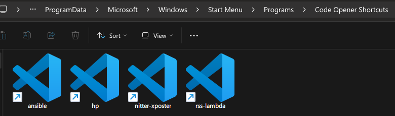
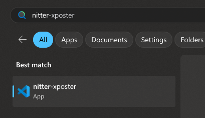

# Code Opener
Syncs your VSCode projects to Start Menu on Windows 10/11

## Motivation
I use VSCode on Windows 11, but a pain point is whenever I want to open a specific project, I have to open VSCode and go to File -> Open Recent and pick the project from there (I could have also opened a terminal and type `code project-dir` but it's also kind of cumbersome).

Ideally I should just be able to search for a project name in the Start Menu and directly open the project from there.

Hence, I built a utility program that syncs VSCode's recently opened projects to Start Menu so that I can press Windows Key, search for a project name, and directly open the project from there.

Essentially, it turns


into



so that I can



## How to use
The program is tested on

- Windows 11 and Windows 10 (although I don't daily drive Windows 10 so bugs specific to 10 might not be caught immediately)
- VSCode stable version (User Install)

Caveats
- The program needs Administrator privilege because it writes to a folder in Start Menu
- Synchronization only happens when VSCode is closed. This is to avoid potential data corruption because it reads a sqlite database that VSCode manages.
- The program might be erroneously identified by Windows Security/Defender as Trojan. This is a [known issue by PyInstaller](https://github.com/pyinstaller/pyinstaller/issues/5854) and please exempt the exe.

Find the latest workflow run in [GitHub Actions tab](https://github.com/sekai-soft/code-opener/actions)

In the artifacts section, download the `windows-executable`

Unzip the downloaded file and run `Code Opener.exe`

The program is a long-running tray application so look for this icon in your system tray area


Right click it to see its logs, open the Start Menu folder that it writes to, etc.

## Like what you see?
Consider support us on [Patreon](https://www.patreon.com/sekaisoft) :)

## Development
Developed on Python 3.12.1 on Windows 11

### Install dependencies
```
python -m venv venv
.\venv\Scripts\activate
pip install -r requirements.txt
```

### Run unit tests
```
.\venv\Scripts\activate
python -m unittest discover
```

### Run program without packaging
```
.\venv\Scripts\activate
pythonw .\tray.py
```

### Package Windows app
```
.\venv\Scripts\activate
pyinstaller --name "Code Opener" --windowed --uac-admin --icon icon.ico --clean .\tray.py
cp icon.ico "dist\Code Opener"
```

Then find the built app in `dist` folder
